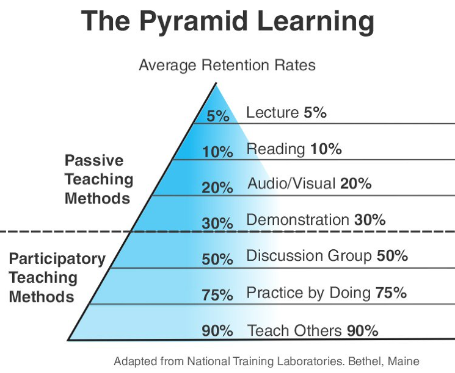

= Fireworks

ifdef::env-github[]
:tip-caption: :bulb:
:note-caption: :information_source:
:important-caption: :heavy_exclamation_mark:
:caution-caption: :fire:
:warning-caption: :warning:
endif::[]

[#name-origin]
== 名称由来

小的时候看过一个动漫《三个火枪手》，根据大仲马同名小说改编的。有个场面非常感人，几个火枪手一起举剑起誓：“人人为我，我为人人”。希望可以传承这种互助精神，相互帮助，相互学习，共同进步！所以，就取“火枪手”为名。

CAUTION: 有任何疑问，欢迎发 Issue 提问。也欢迎每一位喜欢计算机的小伙伴发 Issue 讨论学习！

[#sponsor]
== 友情支持

如果您觉得这个笔记对您有所帮助，看在D瓜哥码字的辛苦上，请友情支持一下，D瓜哥感激不尽，😜

[cols="2*^",frame=none]
|===
| image:images/alipay.png[title="支付宝", alt="支付宝", width="45%"] | image:images/wxpay.png[title="微信", alt="微信", width="45%"]
|===

有些打赏的朋友希望可以加个好友，欢迎关注D瓜哥的微信公众号，这样就可以通过公众号的回复直接给我发信息。

image:images/wx-jike-log.png[align="center",width=90%]

TIP: **公众号的微信号是: jike-log**。__因为众所周知的原因，有时图片加载不出来。如果图片加载不出来可以直接通过搜索微信号来查找我的公众号。__

[#purpose]
== 宗旨

火枪手帮带计划是一个公益活动，不需要参与人缴纳任何费用。有收益，也要有付出。**要求每一个徒弟在大三以后也要收最少两个师弟或者师妹为徒，帮忙他们解答学习疑问，指点学习方向。人人为我，我为人人。**这就是我们的宗旨。希望各位参与者薪火传递，生生不息。

[#task]
== 辅导任务

. 帮忙徒弟解答学习疑问，指点学习方向。
.. 注意提高学习方法，授人以鱼不如授人以渔。
.. 学习没有捷径！不走弯路就是最好的捷径。所以，要把握徒弟的学习方向，不要误入歧途。
.. 注意：学习是自己的事情。师傅领进门，修行看个人。所以，建议师傅不要强制要求徒弟的学习时间和学习计划。
. 每两周或者每月做一次语音沟通。非硬性要求，请根据情况做适当调整。
. 分享优质资料，帮助徒弟开阔眼界，提高认识。
. 协作徒弟在大二或研一暑假寻找实习机会。每个人水平各有不同，各个企业也有不同要求，见机行事，尽力就好。
. 协助徒弟提前做好校招的准备工作，内推优质企业，解答应聘问题，收获满意Offer。

[#learnin-plan]
== 学习攻略

大学时间宝贵，虽然有四年大学时光，但是校招一般会安排在大四九月份，再去掉刚入大学懵懂无知的半年，算下来学习时间也就只有两年半的时间了。需要认真安排自己的学习计划的。鉴于很多在校生对大学课程的整体安排没有一个全面的认识，所以，整理了这样一份学习攻略。

详细内容请看： xref:plan.adoc[大学计算机学习攻略^]。

[#learning-advice]
== 学习建议

. **学会 https://haoel.github.io/[科学上网^]。** -- 必做任务。穿越长城，走向世界。
. **学好英语，直接看英文原版资料。** -- 必做任务。希望各位参与者每天抽出一个小时时间来学习英语。最好听说读写全面提高。**真正的墙，并不是 GFW，而是语言。**当面对众多优质英文资料却读不懂，看不会，那才是悲剧。
. **爱祖国，上 https://www.google.com/[Google^]。** -- 必备技能。
. **搜索程序相关问题， https://stackoverflow.com/[Stack Overflow^] 是第一选择。** -- 必备技能。不夸张地说，没有 Stack Overflow 解答不了的技术问题。
. **百科只认 https://en.wikipedia.org/[Wikipedia^]。** -- 解释更全面，内容更全面，更新更及时。
. **必须学会使用 https://github.com/[GitHub^]。** -- 必做任务。希望把大学的代码都放到 GitHub 上。
. **到毕业为止刷够 500 道 https://leetcode.com/problemset/all/[LeetCode^] 题。** -- 必做任务。**注意：一定要是用英文网站。**
. **推荐学习一个轻量级标记语言。** -- 非硬性要求。不过，好处多多，谁用谁知道。
.. https://asciidoctor.org/docs/asciidoc-syntax-quick-reference/[AsciiDoc Syntax Quick Reference^] -- 强烈推荐学习 AsciiDoctor。在增加稍许复杂度的情况下，功能更加强大，工具链也更加完整。
.. https://guides.github.com/features/mastering-markdown/[Mastering Markdown · GitHub Guides^] -- Markdown 可以说是随着 GitHub 而发扬光大的，GitHub 对其支持的非常好。在 Issue，README 等各方面都可以使用。
. **学习一门技术请认准官方文档，先通读一遍官方文档再说。** -- 学习中遇到的很多问题，基本在官方文档中都有介绍，看官方文档虽然略慢，但是大巧若拙。另外，大多数技术都起源于美国。所以，学好英文，看英文原版资料是基础技能。
. **刷论坛，看文章，优先选择 https://medium.com/[Medium^]。** -- 一个非常好的社区。请科学上网。
. **看书首选经典。** -- 由于很多因素，导致学校在给学生购买教程时，往往选的都是垃圾。所以，在教程之外，推荐在购买一本经典书相辅。选书就上 https://book.douban.com/[豆瓣读书^]，评分在八分以上就是好书，在九分以上就是神书。
. **勤做学习总结，多发表技术文章。** -- 学习一定要有产出，这样才更有效率。所以，要把自己的学习成果记录下来，然后发表成博客。这样有更多机会接触更优秀的人。获取反馈，改造不足，提高自己。示例博客： https://www.diguage.com/["地瓜哥"博客网^]。

[#prohibited]
== 禁止事项

. 坚决禁止使用百度。请用 https://www.google.com/[Google^]。
. 坚决禁止使用百度百科和互动百科。请用 https://en.wikipedia.org/[Wikipedia^]。
. 坚决禁止使用 CSDN。
.. 查问题，请用 https://stackoverflow.com/[Stack Overflow^]；
.. 看博客，请用 https://medium.com/[Medium^]。
.. 写博客，请自建博客。推荐 GitHub Pages 或者 WordPress。
. 禁止刷抖音。
. 禁止刷盆友圈。
. 禁止刷知乎。
. 禁止刷今日头条以及各种国内新闻 APP。
. 禁止刷微博。
. 禁止刷微信公众号。

这里说明一下，“坚决禁止” 事项已经给出更佳方案，请选择更佳方案。“禁止”事项，如果可以完全杜绝更好；退而求其次，禁止长时间沉浸其中。

[#learning-strategy]
== 学习方法

在学习某个技术的时候，除了会用到的知识图，还会问自己很多个为什么。于是，就形成了一个更高层的知识脑图。下面把这个学习方法或者学习模板分享出来。当然学习一门技术时，Go 语言也好，Docker 也好，只有把这个学习模板中的内容都填实了，才善罢甘休。这个模板如下：

. **这个技术出现的背景、初衷和要达到什么样的目标或是要解决什么样的问题。**这个问题非常关键，也就是说，你在学习一个技术的时候，需要知道这个技术的成因和目标，也就是这个技术的灵魂。如果不知道这些的话，那么你会看不懂这个技术的一些设计理念。
. **这个技术的优势和劣势分别是什么，或者说，这个技术的 trade-off 是什么。**任何技术都有其好坏，在解决一个问题的时候，也会带来新的问题。另外，一般来说，任何设计都有 trade-off（要什么和不要什么），所以，你要清楚这个技术的优势和劣势，以及带来的挑战。
. **这个技术适用的场景。**任何技术都有其适用的场景，离开了这个场景，这个技术可能会有很多槽点，所以学习技术不但要知道这个技术是什么，还要知道其适用的场景。没有任何一个技术是普适的。注意，所谓场景一般分别两个，一个是业务场景，一个是技术场景。
. **技术的组成部分和关键点。**这是技术的核心思想和核心组件了，也是这个技术的灵魂所在了。学习技术的核心部分是快速掌握的关键。
. **技术的底层原理和关键实现。**任何一个技术都有其底层的关键基础技术，这些关键技术很有可能也是其它技术的关键基础技术。所以，学习这些关键的基础底层技术，可以让你未来很快地掌握其它技术。可以参看我在 CoolShell 上写的 Docker 底层技术那一系列文章。
. **已有的实现和它之间的对比。**一般来说，任何一个技术都会有不同的实现，不同的实现都会有不同的侧重。学习不同的实现，可以让你得到不同的想法和思路，对于开阔思维，深入细节是非常重要的。

基本上来说，如果按照上面所提的这 6 大点来学习一门技术，一定会学习到技术的精髓，而且学习的高度在一开始就超过很多人了。如果能这样坚持 2-3 年，相信一定会在某个领域成为炙手可热的佼佼者。

TIP: “学习方法”摘自 http://gk.link/a/1009i[左耳朵耗子的专栏“左耳听风”^]。这是“极客时间”上含金量最高、干货最充足的专栏。强烈推荐购买。

[#appendix]
== 附录

如有疑问、意见或者建议，请发 Issue 告知。（不保证回复时间。）